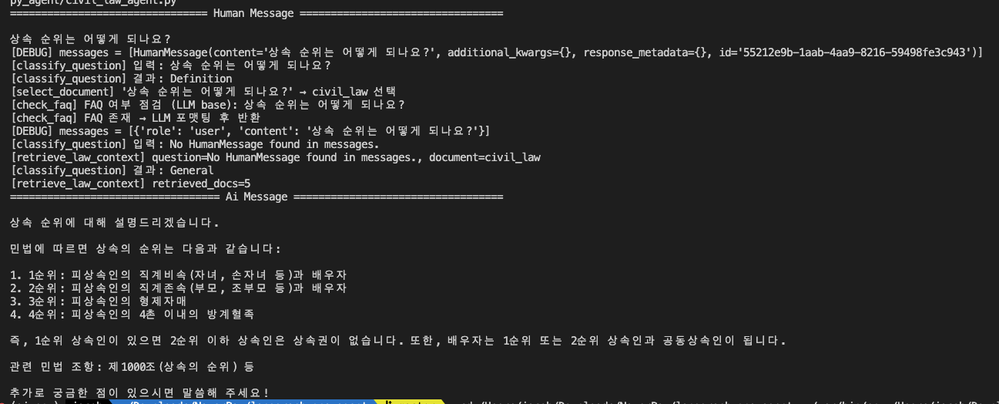

# LangGraph Q&A Civil Law Agent

한국 민법 관련 질문에 대해 AI가 민법 조문과 FAQ를 기반으로 정밀하게 답변합니다.
LangGraph 기반 도구 체계를 활용하여 질문을 분류하고, 필요 시 FAQ 또는 법률 문서 검색을 수행합니다.

---

## 개발 환경

### LLM Framework


### LLM Service


### Vector Database


## 기술 스택

- **LangGraph**: 워크플로우 및 도구 기반 에이전트 구성
- **LangChain**: LLM 연결 및 Retriever 구성
- **Pinecone**: 벡터 검색 인덱싱 (조문/FAQ)
- **OpenAI GPT-4.1**: LLM 응답 생성
- **Markdown**: PDF → Markdown 조문 전처리

## 주요 기능

- **질문 분류**: 정의 / 요건 / 절차 / 예외 등으로 자동 분류
- **문서 선택**: 민법 외 형법, 판례 등 다양한 법률 문서로 확장 가능
- **FAQ 응답**: 자주 묻는 질문(FAQ)에 대한 빠르고 정확한 응답
- **조문 검색**: 관련 조항을 벡터 검색으로 탐색 후 인용 응답 생성
- **툴 실행 로그**: 실행 단계별 로그로 디버깅 및 품질 개선 용이

| Tool 이름              | 설명                                          |
| :--------------------- | :-------------------------------------------- |
| `classify_question`    | 질문을 정의/요건/절차/비교/일반으로 분류      |
| `select_document`      | 문서 선택 (현재는 민법으로 고정)              |
| `check_faq_ver3`       | FAQ 여부 판단 (3가지 전략 중 하이브리드 채택) |
| `retrieve_law_context` | 민법 조문 벡터 검색 수행                      |
| `answer_via_faq`       | FAQ 기반으로 즉시 응답 반환                   |

### check_faq Tool 버전 비교

| 버전   | 방식                | 정확도    | 속도 | 설명                            |
| ------ | ------------------- | --------- | ---- | ------------------------------- |
| `ver1` | 단순 벡터 존재 유무 | 낮음      | 빠름 | context만 있으면 FAQ로 판단     |
| `ver2` | LLM 프롬프트 기반   | 높음      | 느림 | LLM이 FAQ 일치 여부를 직접 판단 |
| `ver3` | 하이브리드          | 중간~높음 | 중간 | context가 충분할 때만 LLM 실행  |

→ 현재 프로젝트에서는 ver3 (하이브리드) 채택

---

## LangGraph 흐름

아래 다이어그램은 질문 처리 흐름을 나타냅니다.

### Diagram


### LangGraph 노드 연결

```plaintext
             +-----------+
             | __start__ |
             +-----------+
                   *
                   *
                   *
             +----------+
             | classify |
             +----------+
                   *
                   *
                   *
            +------------+
            | select_doc |
            +------------+
                   *
                   *
                   *
             +-----------+
             | faq_check |
             +-----------+
            ...         ...
           .               .
         ..                 ..
+------------+           +-----------+
| faq_answer |           | law_agent |
+------------+           +-----------+
            ***         ***
               *       *
                **   **
              +---------+
              | __end__ |
              +---------+
```

### **폴더 구조**

CLI와 같은 실사용 흐름을 강조했으므로, 다음처럼 폴더 구조도 시각화하면 이해가 빠릅니다.

```bash
project-root/
│
├── py_agent/
│   ├── civil_law_agent.py      # 메인 실행 파일
│   ├── faq_uploader.py         # FAQ 마크다운 일괄 업로드
│   ├── pdf_to_markdown.py      # OCR 없는 PDF 처리
│   ├── pdf_to_markdown_ocr.py  # OCR 필요 문서 처리 (Zerox AI)
│
│
├── civil_law_faq.md            # FAQ
├── agent_history.log           # 로그 기록
├── README.md
│
├── output
│   ├── civil_law_articles.md   # 민법 마크다운
│
└── screenshots/
│   ├── ver2.png                # CLI 예시 캡처
│   ├── diagram2.png            # LangGraph 흐름
│
└── documents
    ├── all_civil_law.pdf       # 민법 원본
```

## 특징

### 문서 전처리 (PDF → Markdown)

- pypdf2 기반 처리 (pdf_to_markdown.py)

-> 이미지 포함되지 않은 PDF 대상이므로 OCR 필요 없음

- OCR 필요 pdf (pdf_to_markdown_ocr.py)

-> zerox AI로 OCR 수행

### FAQ 업로드

- faq_uploader_poc.py: 수동으로 텍스트 FAQ 추가

- faq_uploader.py: 마크다운 FAQ 일괄 등록 테스트 버전

## 🚀 실행 예시

```python
if __name__ == "__main__":
    query = "상속 순위는 어떻게 되나요?"

    for chunk in law_agent_executor.stream(
        {"messages": [HumanMessage(content=query)]}, stream_mode="values"
    ):
        chunk["messages"][-1].pretty_print()

```

### 출력 예시



```
================================ Human Message =================================

상속 순위는 어떻게 되나요?
[DEBUG] messages = [HumanMessage(content='상속 순위는 어떻게 되나요?', additional_kwargs={}, response_metadata={}, id='55212e9b-1aab-4aa9-8216-59498fe3c943')]
[classify_question] 입력: 상속 순위는 어떻게 되나요?
[classify_question] 결과: Definition
[select_document] '상속 순위는 어떻게 되나요?' → civil_law 선택
[check_faq] FAQ 여부 점검 (LLM base): 상속 순위는 어떻게 되나요?
[check_faq] FAQ 존재 → LLM 포맷팅 후 반환
[DEBUG] messages = [{'role': 'user', 'content': '상속 순위는 어떻게 되나요?'}]
[classify_question] 입력: No HumanMessage found in messages.
[retrieve_law_context] question=No HumanMessage found in messages., document=civil_law
[classify_question] 결과: General
[retrieve_law_context] retrieved_docs=5
================================== Ai Message ==================================

상속 순위에 대해 설명드리겠습니다.

민법에 따르면 상속의 순위는 다음과 같습니다:

1. 1순위: 피상속인의 직계비속(자녀, 손자녀 등)과 배우자
2. 2순위: 피상속인의 직계존속(부모, 조부모 등)과 배우자
3. 3순위: 피상속인의 형제자매
4. 4순위: 피상속인의 4촌 이내의 방계혈족

즉, 1순위 상속인이 있으면 2순위 이하 상속인은 상속권이 없습니다. 또한, 배우자는 1순위 또는 2순위 상속인과 공동상속인이 됩니다.

관련 민법 조항: 제1000조(상속의 순위) 등

추가로 궁금한 점이 있으시면 말씀해 주세요!
```

## 기타 가이드

### .env 파일 필요 (API 키 등)

```
OPENAI_API_KEY=sk-...
PINECONE_API_KEY=...
```
